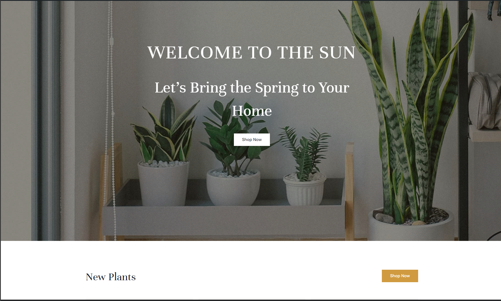
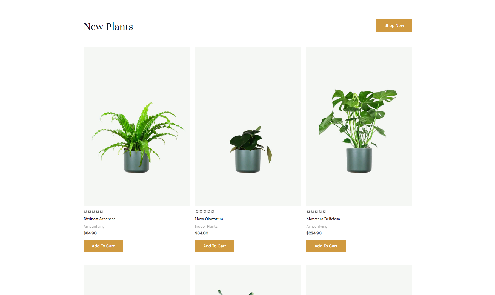

# The Sun
wordpress project 

Welcome to the The Sun myt first wordpress project
this is an ecomerce project built for my coding academy as project 9
plugin and thems used in this project : 
 


 # Screenshots 
 
 


# Prerequisites

Ensure you have the following installed:

Web Server: Apache, NGINX, or another compatible web server
PHP: Version 7.4 or higher
MySQL: Version 5.6 or higher / MariaDB Version 10.1 or higher

# Installation
1. Clone the Repository

```
git clone https://github.com/your-username/your-wordpress-project.git
cd your-wordpress-project
```
2. Create a Database

Create a new MySQL database for your WordPress site:

```
CREATE DATABASE your_database_name;
```

3. Configure wp-config.php

Rename wp-config-sample.php to wp-config.php:

```
mv wp-config-sample.php wp-config.php
```

Open wp-config.php and update the database credentials:

```
define('DB_NAME', 'your_database_name');
define('DB_USER', 'your_database_user');
define('DB_PASSWORD', 'your_database_password');
define('DB_HOST', 'localhost');
```

4. Run the WordPress Installation

Open your web browser and navigate to your local development URL (e.g., http://localhost). Follow the WordPress installation instructions.

5. Start Developing
You're all set! You can now start developing your WordPress project.